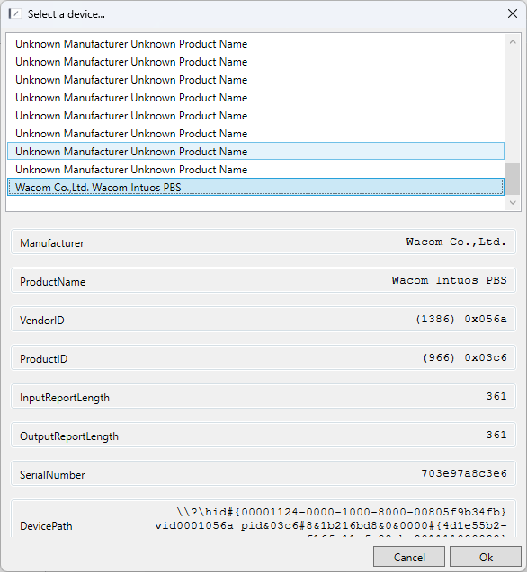
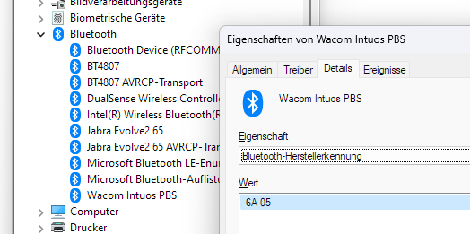

# Experimental OpenTabletDriver

## About

This fork of [OpenTabletDriver](https://github.com/OpenTabletDriver/OpenTabletDriver) introduces wireless support for the Wacom Intuos2 CTL-4100WL bluetooth tablet in release v0.6.0.4, the latest stable release as of May 2024.

The `wireless_op` branch implements these changes, based on [pull request 2628](https://github.com/OpenTabletDriver/OpenTabletDriver/pull/2628) by [IllustratedMan-code](https://github.com/IllustratedMan-code).

Please note: To use this feature, ensure to update the vendor ID and product ID in `OpenTabletDriver.Configurations\Configurations\Wacom\CTL-4100WL.json`. These IDs correspond to the Bluetooth adapter, not the tablet itself, and may vary across machines.

## Obtaining your vendor and product ID

I currently know two ways to find your specific vendor and product ID. Connect your device via BT and use one of the methods below.

### Using the latest OpenTabletDriver GUI

1. build the latest development version of OTD
2. run the GUI (`.\bin\OpenTabletDriver.UX.Wpf.exe`)
3. select `Tablets -> Configuration Editor` from the menu
4. click on `Generate`
5. select your Wacom device from the list
6. write down VendorID and ProductID in decimal notation

### using the Windows Device Manager

1. open the Device Manager
2. find the `Wacom Intuos PBS` Bluetooth device
3. right click the entry and select `Properties`
4. go to the `Details` tab
5. find the entries for `Bluetooth vendor ID` and `Bluetooth product ID` (I do not know the exact english terms)
6. each should contain two hex values, for example `6A 05`
7. switch the two values and convert the resulting number to decimal (google `0x056A to decimal` gives 1386)

